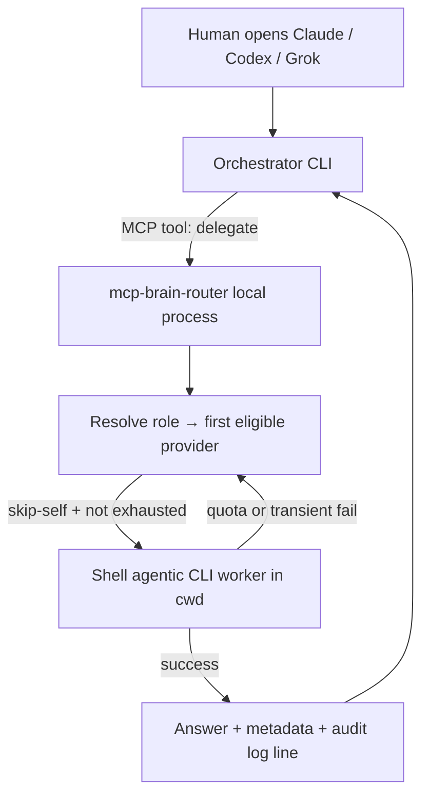
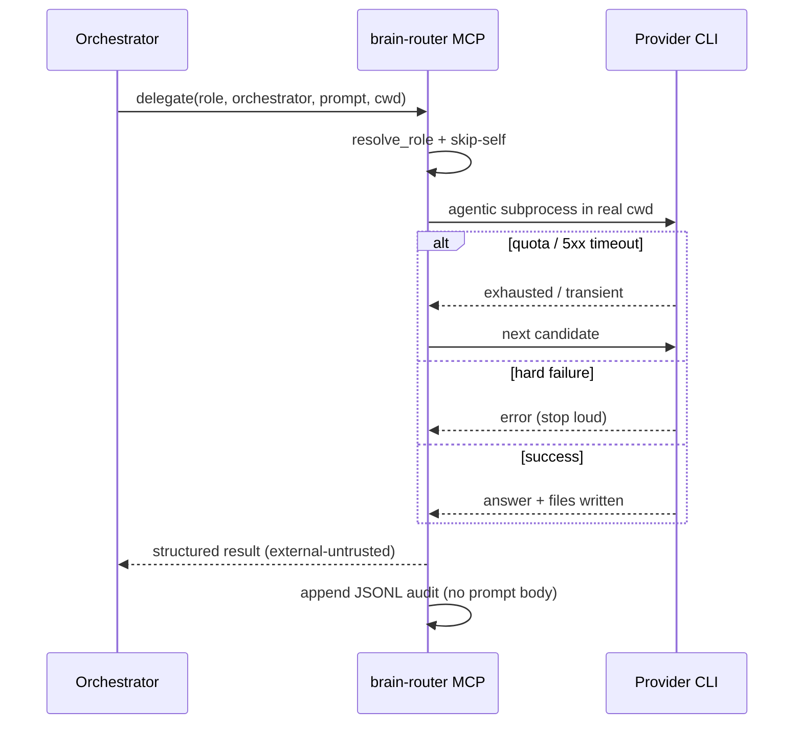

> **Snapshot:** local e5524eb (working tree DIRTY: budget shards + universal skip-self) · vps kamakshi checked / brain-router NOT deployed · package 0.1.1 · generated 2026-07-30T04:47:26Z · first-hand verified this run.

# EXPLAINER — mcp-brain-router

**In plain terms:** You work in Claude, Codex, or Grok. When a sub-task should not burn that seat's quota, you call one tool — **delegate**. A small local program (this MCP server) picks the right worker from an ordered list for that *job type*, runs an agent that can edit files in your project folder, and returns the answer plus metadata. If the first worker is out of quota (or briefly broken), it tries the next — nothing else.

## The idea

- **Orchestrator** = the brain you already opened (Claude / Codex / Grok). Chosen by you, never by the router.
- **Role** = the job you want done: build (`worker`), small task (`simple`), hard think (`thinker`), red-team (`adversary`).
- **Shard** = ordered list of providers for that job. Example (working-tree defaults, 2026-07-26 budget pass): worker leads with Kimi, then Grok, then Claude Sonnet, then Codex Terra.
- **Skip-self** = never assign work back to the same provider as the orchestrator (avoids nested clones of yourself).
- **Agentic** = the worker may write files and run checks in your real project directory — not just chat back text.

## Main flow

## One call, sequence

## What you configure once

Installer writes a private config file (owner-read-only) with API keys for HTTP providers and flags for CLI providers (Codex / Grok / Kimi). The same MCP is registered into each host CLI with a **caller identity** so the router knows who is speaking.

## What it is not

- Not a cloud API you hit over the public internet for routing.
- Not Open Brain (memory/search on the VPS) — different product; both may appear as MCP tools but solve different jobs.
- Not an excuse to trust worker output blindly — results are labeled untrusted external content.

## Deploy picture (honest)

| Where | Status (this run) |
|-------|-------------------|
| Your Mac, Claude/Codex/Grok sessions | **Live path** |
| kamakshi VPS | **Not installed** (ssh inventory: no container, no config, no state) |
| PyPI / Homebrew / GitHub | Public distribution channels for the package |

## Success in one sentence

You keep judgment on the expensive seat; file-writing grunt work and second opinions ride cheaper or specialized workers, with a single audited cascade policy.
